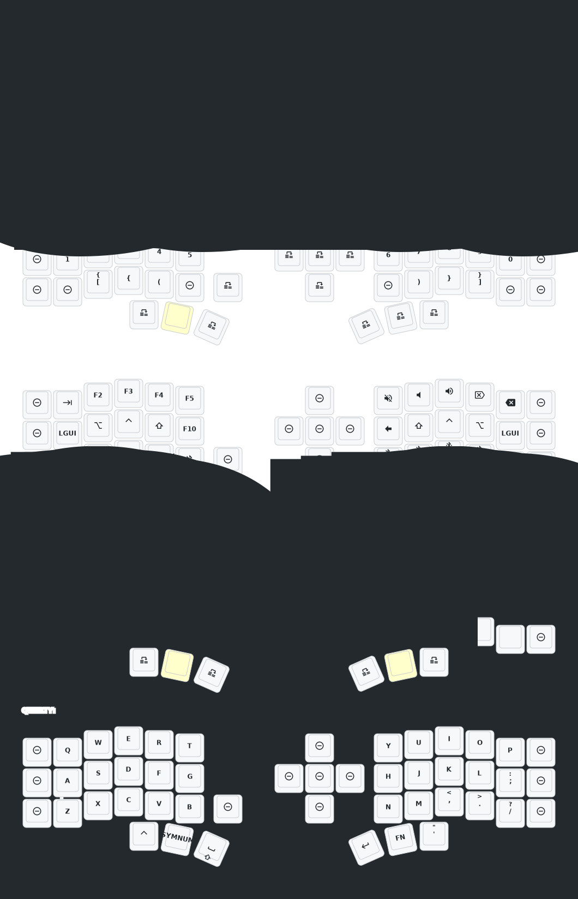

# (Eyelash Peripherals) Corne ZMK Repositor

**This keyboard is not the same as [foostan's Corne](https://github.com/foostan/crkbd). It will not work with standard `corne` firmware.**

This is my personal configuration repo. for a 3x5+3 hardware withouit display.

## Keymap Diagram

